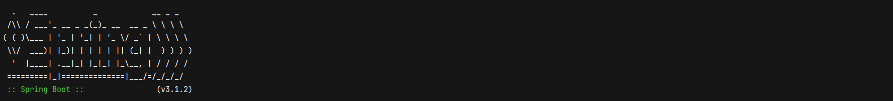

# CRUD LANGUAGES MySql + Spring Boot - Coding Dojo
Para este proyecto se trabajará con thymeleaf solo para
poder renderizar vistas, la lógica de las peticiones se realizarán
con javascript para lograr entrenar el manejo del
front y poder escalar mis creaciones en algo mas generalizado.

### Características
- Crear registros
- Editar
- Borrar
- Mostrarlos
- Navegación entre diferentes vistas (Javascript + Thymeleaf)

